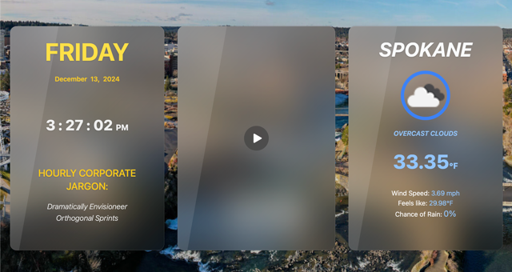

# Smart Mirror Project for CSCD 378

This is my submission for the Smart Mirror project. 

I've used the Astro/Tailwind/DaisyUI template and migrated the basic content from my
initial NFC Dashboard attempt.

I modified the styling and envisioned this as more of a compact/handheld mirror rather than
a wall mounted mirror - so the background reflects the city used for the weather card.

Following that - the components have been separated into 3 separate cards, with the camera "mirror" portion in the middle - to give the effect of a trifold, but the wings providing
useful daily info instead of different angles.

